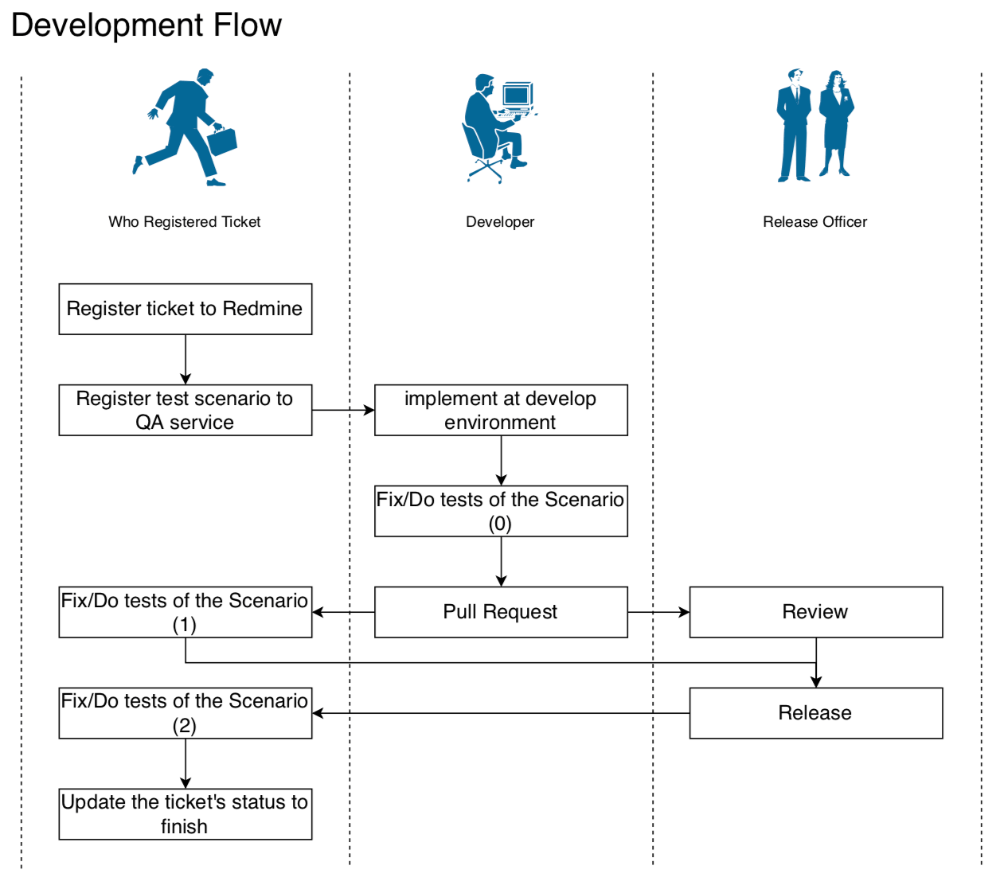
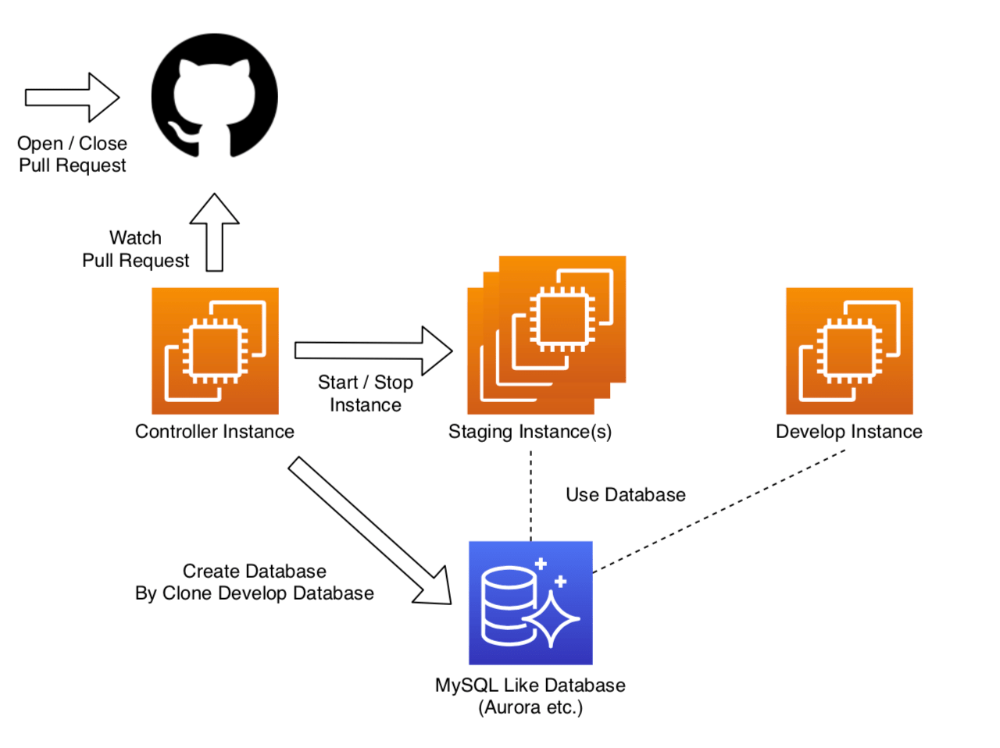

# pullre-kun

Light weight netlify-like server-side CI build system using EC2 instance

- No docker.
- Some IAM policies(DescribeInstances, StartInstances, StopInstances) are needed.
- At least, two ec2-instances are needed. 
- One MySQL like database is needed.

# License

MIT

# Concept / Purpose of this application

create PR (on GitHub) -> start EC2 instance automatically -> happy!

We made some workflow using GitHub and GitHub flow:



For implement this flow, we need some system that automatically create staging environment as soon as pull request is made.
Unfortunately, we had issues:

- Database Scheme. The developer's database is ready to test the functions, but the database of staging environment is not ready to test.
- We couldn't use docker for some tests.

This application is the solution of these issues. The system configuration is here.



# Usage (Installation)

## create ec2-instances

Create EC2 instances. And allow port 5250 for the one of them. The one is called "Controller Instance".
The others are called "Staging Instance". 

## create IAM policy and user

Create IAM policy that allowed following actions:

"ec2:DescribeInstances"
"ec2:StartInstances"
"ec2:StopInstances"

The resources of policy are instances you created.
And attach the policy to user/role, then save the ACCESS KEY and SECRET KEY.

## install git

Install git for the whole instances.
note: if you use amazon linux2,

```bash
$ sudo yum install git
```

## setup your application to staging servers

Setup your application to staging servers.

## install python3.8

Install python3.8 for the whole instances.
note: if you use amazon linux2,

```bash
$ amazon-linux-extras install python3.8
$ sudo yum python38-devel
$ sudo yum install gcc
$ sudo yum install gcc-c++
```

## install mysql-client

Install mysql-client for the whole instances.
note: if you use amazon linux2,

```bash
$ sudo yum install mysql
```

## run or install some MySQL like database

Run or install some MySQL like database.

## clone pullre-kun

Clone pullre-kun.

## install requirements

Install the requirements.

## run get_basic_token.py

Controller instance has basic authentication. You should create the token(hash) of password, and save it to app.ini.

## create app.ini file

Create app.ini file. The sample is app.ini.default. And deploy it for the whole instances.

## edit crontab of controller server

Add following line to crontab of **controller server**.

```
* * * * * cd /home/ec2-user/pullre-kun; python3.8 update_pull.py
```

## edit crontab of staging server

Add following line to crontabs of **staging servers**.

```
* * * * * cd /home/ec2-user/pullre-kun; python3.8 client.py
```

## run init.py

Execute following command at **controller server**.

```bash
$ cd ~/pullre-kun
$ python3.8 init.py
```

## run pullre-kun application

Execute following command at **controller server**.

```bash
$ cd ~/pullre-kun
$ nohup python3.8 app.py &
```

## register servers

Access https://(your-domain)/server/list, then you would see the whole servers.
Then you click register button of staging servers.
And access https://(your-domain)/master/server, and update the db_schema of each record.

## register users

Access https://(your-domain)/master/git_hub_users, and register the users.
"login" is github user login, db_schema is the original schema of clone.

# Note

manual alembic(old version)

## create alembic.ini

Create alembic.ini file. The sample is alembic.ini.default.
Usually, you edit database connection string only.

## run alembic

Execute following command at **controller server**.

```bash
$ export PYTHONPATH=/home/ec2-user/pullre-kun
$ cd /home/ec2-user/pullre-kun/alembic
$ alembic revision --autogenerate -m update
$ alembic upgrade head
```
